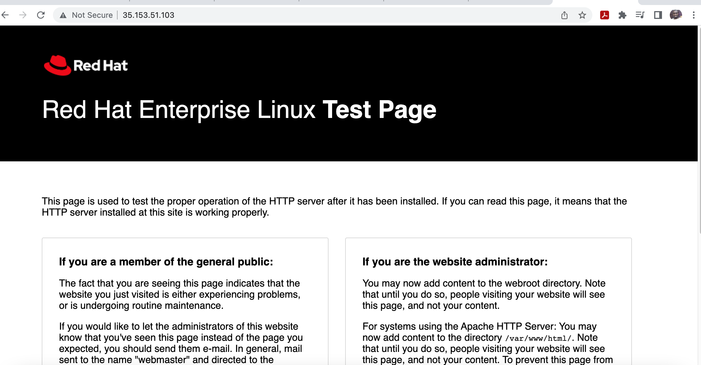
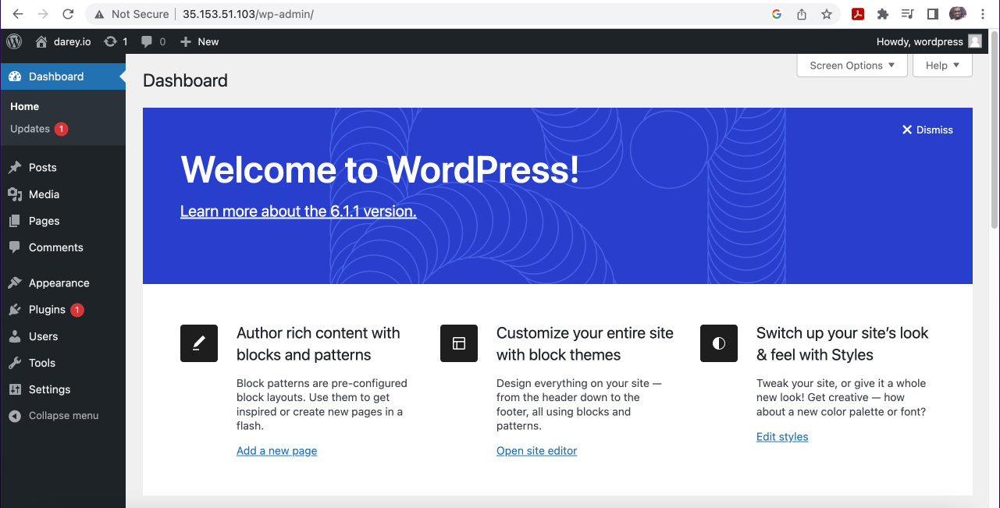

## Documentation Project 6
Check the attached partitions
`lsblk`

Create partitions after adding volume on AWS
type 'n' or on first prompt, hex code '8e00', second prompt 'p', third prompt 'w'
Create partitions after adding volume on AWS

`sudo gdisk /dev/xvdf`

`sudo gdisk /dev/xvdg`

`sudo gdisk /dev/xvdh`


Install lvm2 - logical volume management
`sudo yum install lvm2 -y`
confirm software is installed with 'which lvm'

Create physical volumes
`sudo pvcreate /dev/xvdf1 /dev/xvdg1 /dev/xvdh1`

To confirm it's created
`sudo lvs`

To add a volume group and add all 3 pvs named webdata-vg
`sudo vgcreate webdata-vg /dev/xvdh1 /dev/xvdg1 /dev/xvdf1`

To confirm volume group created

`sudo vgs`

To create 2 logical volumes apps-lv to stored website data and logs-lv to store data for logs

`sudo lvcreate -n apps-lv -L 14G webdata-vg`

`sudo lvcreate -n logs-lv -L 14G webdata-vg`

to confirm logical volume is running

`sudo lvs`

View entire setup

```bash
sudo vgdisplay -v #view complete setup - VG, PV, and LV
sudo lsblk
```

`sudo mkfs.ext4 /dev/webdata-vg/apps-lv`

`sudo mkfs.ext4 /dev/webdata-vg/logs-lv`

-p to create parent directory if they are not existing
`sudo mkdir -p /var/www/html`

` sudo mkdir -p /home/recovery/logs`

Mount formats the directory so check it is empty
`sudo mount /dev/webdata-vg/apps-lv /var/www/html/`

Backup files in the /var/log directory to /home/recovery/logs
`sudo rsync -av /var/log/. /home/recovery/logs/`

To mount /var/log on logs-lv
`sudo mount /dev/webdata-vg/logs-lv /var/log`

Copying back to /var/log

`sudo rsync -av /home/recovery/logs/. /var/log/`

### To populate fstab and make mount configuration persist after restart of server

Get blockid

`sudo blkid`

Paste the UUID to the fstab without the quotation marks

`sudo vi /etc/fstab`

Include the location, file system type and defaults

```bash
/dev/mapper/webdata--vg-apps--lv: UUID=6dce0630-80b0-427f-97ab-94488eb74aa0 /var/www/html ext4 defaults 0 0
/dev/mapper/webdata--vg-logs--lv: UUID=c6ee3643-9fcb-4bd8-9399-36944d20d6c2
```

To test the configuration and reload daemon

`sudo mount -a`

`sudo systemctl daemon-reload`


### Preparing the Server
Check the attached partitions
`lsblk`

Create partitions after adding volume on AWS
type 'n' or on first prompt, hex code '8e00', second prompt 'p', third prompt 'w'


`sudo gdisk /dev/xvdf`

`sudo gdisk /dev/xvdg`

`sudo gdisk /dev/xvdh`

Install lvm2 - logical volume management
`sudo yum install lvm2 -y`
confirm software is installed with 'which lvm'

Create physical volumes
`sudo pvcreate /dev/xvdf1 /dev/xvdg1 /dev/xvdh1`

To confirm it's created
`sudo lvs`

To add a volume group and add all 3 pvs named webdata-vg
`sudo vgcreate vg-database /dev/xvdh8 /dev/xvdg1 /dev/xvdf1`

To confirm volume group created

`sudo vgs`

To create 2 logical volumes apps-lv to stored website data and logs-lv to store data for logs

`sudo lvcreate -n db-lv -L 20G vg-database`

to confirm logical volume is running

`sudo lvs`

View entire setup

```bash
sudo vgdisplay -v #view complete setup - VG, PV, and LV
sudo lsblk
```

To make the directory '/' means it created in the root directory

`sudo mkdir /db`

To create file system

`sudo mkfs.ext4 /dev/vg-database/db-lv`

Check that it's mounted

`df -h`

Checking content of the directory

`sudo ls -l /db`

### To make the mount persistent
To get the UUID
`sudo blkid`

Paste the UUID to the fstab without the quotation marks

`sudo vi /etc/fstab`

Include the location, file system type and defaults

```bash
UUID=902e594a-fc23-4bfa-809e-68d0ebf5f9ef /db ext4 defaults 0 0
```

To test the configuration and reload daemon

`sudo mount -a`

`sudo systemctl daemon-reload`

`sudo df -h`

## Install wordpress on webserver ec2

Update the repository

`sudo yum -y update`

Install wget, Apache and it’s dependencies

`sudo yum -y install wget httpd php php-mysqlnd php-fpm php-json`

Install the latest version of php/ To install PHP and it’s depemdencies

```bash
https://techviewleo.com/enable-epel-remi-repos-rocky-linux/
```
`sudo yum install php php-opcache php-gd php-curl php-mysqlnd`

Check php version

`sudo php -v`

Start the php-fpm processor

`sudo systemctl start php-fpm`

Enable it

`sudo systemctl enable php-fpm`

Set policy to allow apache to allow boolean

`sudo setsebool -P httpd_execmem 1`

Start Apache

`sudo systemctl start httpd`

Check that Apache is running on the webserver public address




### Download wordpress and copy wordpress to var/www/html

  `mkdir wordpress && cd wordpress`

Downloading wordpress

  `sudo wget http://wordpress.org/latest.tar.gz`

  To extract

  `sudo tar xzvf latest.tar.gz`

  This creates extract folder 'wordpress'
  
  Change dir to wordpress subfolder

  `cd wordpress`

  Run below command to copy to new file wp-config.php

  `sudo cp -R wp-config-sample.php wp-config.php`

Change dir to main wordpress folder

`cd ..`

Copy wordpress to /var/www/html/

`sudo cp -R wordpress /var/www/html/`

`cd /var/www/html`

To remove the dir contents

`sudo rm -rf wordpress lost+found`

Change dir to main wordpress folder.

Copy wordress dir to html dir

`sudo cp -R wordpress/. /var/www/html/`

`cd /var/www/html`
 
Install mysql server 

`sudo yum install mysql-server`

`sudo systemctl start mysqld`

`sudo systemctl enable mysqld`

## Install mysql server on database server

`sudo yum install mysql-server`

`sudo systemctl start mysqld`

`sudo systemctl enable mysqld`

`sudo mysql_secure_installation`

Select 'n', use simple password, remove anonymous users, and yes to all the prompts

`sudo mysql -p`

`create database wordpress`

Using % to connect from anywhere 

`CREATE USER 'wordpress'@'%' IDENTIFIED BY 'mypass'`

`GRANT ALL ON wordpress.* TO 'wordpress'@'%';`

`flush privileges;`

Check users have been created

`select user, host from mysql.user;`

Set the bind address

`sudo vi /etc/my.cnf`
 
 Paste in

 ```bash
 [mysqlnd]
 bind-address=0.0.0.0
```

 exit

`sudo systemctl restart mysqld`

## Edit wp-config.php on the webserver

`sudo vi wp-config.php`

Edit the details as shown below

```bash
/** The name of the database for WordPress */
define( 'DB_NAME', 'wordpress' );

/** Database username */
define( 'DB_USER', 'wordpress' );

/** Database password */
define( 'DB_PASSWORD', 'mypass' );

/** Database hostname */
define( 'DB_HOST', '172.31.50.132' );
```

Restart apache

`sudo systemctl restart httpd`

Disable apache default page

`sudo mv /etc/httpd/conf.d/welcome.conf /etc/httpd/conf.d/welcome.conf_backup`

To confirm webserver can talk to the database server

`sudo mysql -h 172.31.50.132 -u wordpress -p`

Change ownership to apache

`sudo chown -R apache:apache /var/www/html`

`sudo chcon -t httpd_sys_rw_content_t /var/www/html -R`

Setting policies

`sudo setsebool -P httpd_can_network_connect=1`

Access wordpress on client public address



